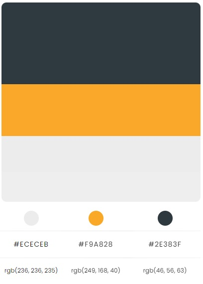

# InnSki Freeride Festival

This is an event website to attract skiers in the Alps of all levels to come together in Innsbruck for three days. During the Freeride Festivel participants will be offered guided freeriding, gear testing and snow safety training.

## Contents

---

- [User Experience](#ux)
  - [User Stories](#user-stories)
  - [Site Owner Goals](#goals)
  - [Target Audience](#target-audience)
  - [User Requirements and Expectations](#user-requirements)
- [Design](#design)
    - [Colour Palette](#colour-palette)
    - [Fonts](#fonts)
    - [Images](#images)
- [Wireframes](#wireframes)
- [Features](#features)

## <a name="ux">User Experience</a>

---

### <a name="user-stories">User Stories</a>

* As a user, I want to understand what the site is about.
* As a user, I want to easily navigate through the site even on the first visit. 
* As a user, I want to find Information on what the event contains and what I can expect. 
* As a user, I want to find where the event takes place. 
* As a user, I want to sign up for the event.  

### <a name="goals">Site Owner Goals</a> 

* As a site owner, I want to inform about the event. 
* As a site owner, I want to inspire users to go freeride skiing. 
* As a site owner, I want people to sign up for the event. 
* As a site owner, I want to increase my reach and visits of the site. 

### <a name="target-audience">Target Audience</a> 

* People who live in Innsbruck and want to explore new freeride options in the local mountains, practise snow safety scenarios or test new equipment. 
* People who don't live in the region, but are interessted in freeride skiing and want to explore the area in a guided and safe manner, practise snow safety scenarios or test new equipment. 

## <a name="design">Design</a>

---

### <a name="colour-palette">Colour Palette</a> 

[*Sourced via Color Hunt.*](https://colorhunt.co/) 

A simple color palette was chosen to reflect the colours of winter and echo the theme of the site. The colours white and dark gray provide a good contrast and the yellow serves to accentuate. The main colours are also present in the imagery and thus perfectly match the design of the site.

### <a name="fonts">Fonts</a> 

[*Sourced via Google Fonts.*](https://fonts.google.com/) 

**Headings:**  "Righteous" Is a modern and more juvenile font that stands out well as a heading and yet is not too distracting and is well readable. Initially I had chosen "Epilogue", but in later stages I found this font too simple and decided to use a font that is more distinctive. 

**Body:** “Roboto”. This font pairs well with Headings and is modern, clean and easy to read. 

### <a name="images">Images</a> 

[*Sourced via Pexels.*](https://www.pexels.com/) & [*Sourced via TVB Innsbruck.*](https://www.innsbruckphoto.at/)

Images are an important aspect of the site, as they should put the user in a winter mood and convey the outdoorsy feeling. Thereby it is easier for the user to get engaged with freeride skiing, regardless of the season or location. 

* A scenic winter image was chosen as a background on each page. 

* The homepage features a picture gallery with impressions of Innsbruck and Freeride Skiing. 

* For each location a picture from that location was added which gives the user an insight into the area. 

## <a name="wireframes">Wireframes</a>

---

 [Click here for original Wireframe](assets/readme/wireframe.pdf)

 Changes to original wireframes:
 * Added a backgroundcolor to text elements that were on top of a background image to make them clearer to read.
 * Added a text area for comments or questions to the sign up form. 
 * On the homepage I changed the text for the hero banner to be centered. 

 ## <a name="features">Features</a>

 ---
Current Features:

* An appealing design and an intuitive navigation and orientation on the website.
* A website which is fully responsive on all screen sizes
* A sign up page to allow customers to book a spot for the festival and also to submit questions.
* Social media links so that users can get in touch with us.

Future Features:

* Add a new page with educational content releated to snow safety.
* After the first event add a testimonal section to homepage. 