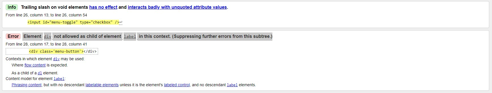
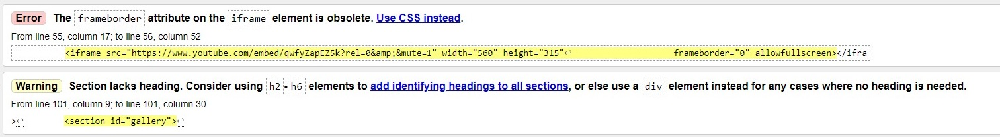
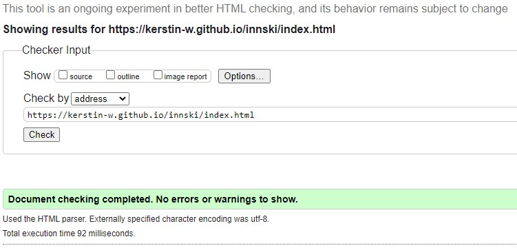
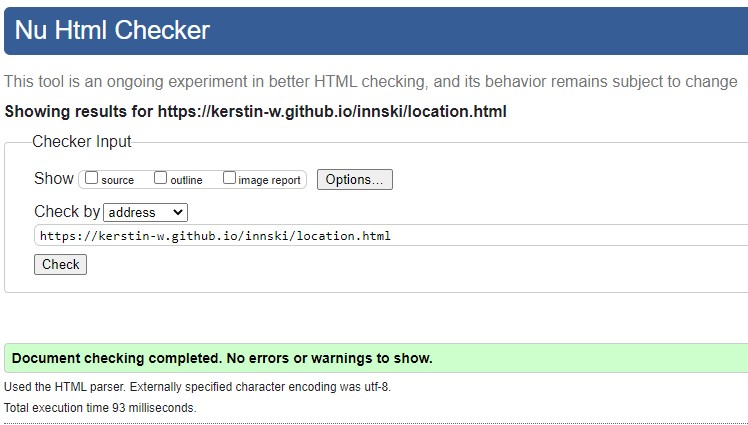
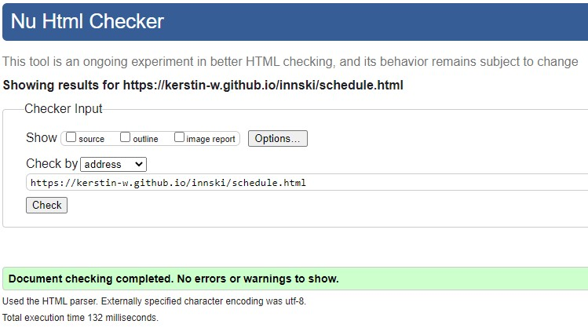
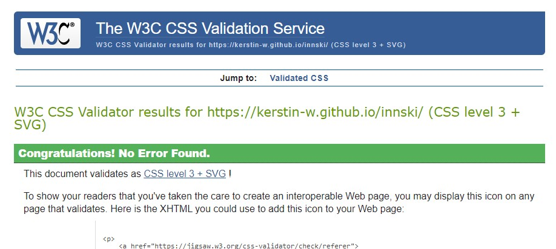
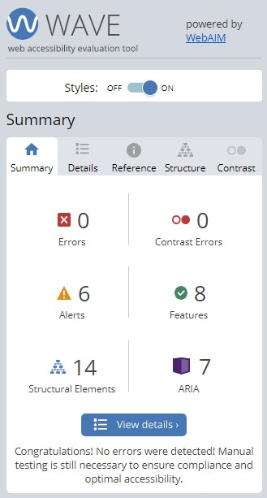

# Testing

## Contents

- [Functional Testing](#functional-testing)
- [Validator Testing](#validator-testing)
  - [HTML](#html)
  - [CSS](#css)
- [WAVE](#wave)
- [LightHouse](#lighthouse)
  - [Destop Results](#desktop-results)
  - [Mobile Results](#mobile-results)
- [Browser Compatibility](#browser-compatibility)
- [Responsivity](#responsivity)
- [User Stories](#user-stories)
- [Site Owner Goals](#goals)
- [Issues/ Bugs Found & Resolved](#issues-bugs)
- [Unresolved](#unresolved)

## <a name="functional-testing">Functional Testing</a>

---

| Page | Test | Completed successfully |
| :----| :----| :---------------------:|
| All | Navigation links to relevant pages | Yes |
| All | Navigation hover effect | Yes |
| All | Navigation collpases to a hamburger menu on mobile | Yes |
| All | Logo links back to homepage | Yes |
| All | Social media icons in the footer link to the correct external link and open in new tab | Yes |
| Homepage| Call to action button links to singup page | Yes |
| Homepage | Images and text flex responsively | Yes |
| Location | Images and text flex responsively | Yes |
| Schedule| Text flex responsively | Yes |
| Sign Up | User can only input the email address in the correct form | Yes |
| Sign Up | User can only submit when all required fields are filled in | Yes |

## <a name="validator-testing">Validator Testing</a>

---

### <a name="html">HTML</a>

[W3C Markup Validator](https://validator.w3.org/)

The initial test returned an error for the Youtube iFrame and a warning for the Gallery section and errors for the hamburger menu. 

Initial test

Homepage

Location Page

Schedule Page

Signup Page

### <a name="css">CSS</a>

[W3C CSS Validator](https://jigsaw.w3.org/css-validator/) 

This test returned no errors.
Results of the CSS test of style.css:

## <a name="wave">WAVE</a>

---

[WAVE](https://wave.webaim.org/)

The WAVE WebAIM web accessibility evaluation tool was used to check for accessibility standards.

The first result gave an error for a missing form label button on the Sign up page and an empty form label for the hamburger menu on the homepage.
- The missing form label button on the Sign up page was due to a typo. 
- Since the hamburger menu could only be created with HTML and CSS (rather than JavaScript which would be the better and accessibility better solution) the HTML symbol for hamburger menu has been added here to fix the bug. 

Afterwards, all pages passed with zero error. 

## <a name="lighthouse">LightHouse</a>

---

Lighthouse was used (accessed through Developer Tools in Chrome) to analyse for the following:  

  - Performance
  - Accessibility
  - Best practice
  - SEO

The initial result was 90 but pointed out that loading time could be improved by properly sizing some images. Therefore, I converted all images from gallery section to .webp format. Even so, the images were still fairly large and I followed my mentor's advice and resized the images.

### Desktop Results

Homepage

Location Page

Schedule Page

Signup Page

### Mobile Results 

Homepage

Location Page

Schedule Page

Signup Page

## <a name="browser-compatibility">Browser Compatibility</a>

---

This website was tested on Chrome, Microsoft Edge, and Firefox for desktop. 

The website was tested on Safari for mobile and tablet. 

* The pseudo-element ::marker with content:"* " was added to a list on the schedule page. As it was found out during testing, the content wasn't supported by Safari. I decided to resolve this issue with a . This was not an appropriate fix either and I solved it with a list style type and marker. Solution found [here](https://css-tricks.com/list-markers-and-string-styles/) 

## <a name="responsivity">Responsivity</a>

---

Responsiveness was tested through Chrome Developer tools. The devices tested include:

- iPhone SE
- iPhone XR
- iPhone 12 Pro
- Pixel 5
- Samsung Galaxy S8+ 
- Samsung Galaxy S20 Ultra
- iPad Air
- iPad Mini
- Surface Pro 7
- Surface Duo
- Galaxy Fold 
- Samsung Galaxy A51

I was able to directly test the website on an iPhone 13 mini and an iPad.

## <a name="user-stories">User Stories</a>

---

* *As a user, I want to understand what the site is about.*

This was achieved through the hero banner, the brief explanation on the homepage and the "What to expect” section. The user gets further and detailed information on the subpages "Location" and "Schedule".

* *As a user, I want to easily navigate through the site even on the first visit.*

This was achieved through a common menu type, repeating patterns through the whole website and self-explanatory links. 

* *As a user, I want to find Information on what the event contains and what I can expect.*

This was achieved through the “What to expect” section on the homepage, the subpage "Schedule" as well as the imagery throughout the whole page. 

* *As a user, I want to find where the event takes place.*

This was achieved through the "Location" subpage and through the Youtube video on the homepage.

* *As a user, I want to sign up for the event.*

This was achieved through the form on the "Sign Up" subpage. 

## <a name="goals">Site Owner Goals</a> 

* *As a site owner, I want to inform about the event.*

This was achieved through the “About” and “What to expect” section on the homepage as well as through the "Schedule" subpage. 

* *As a site owner, I want to inspire users to go freeride skiing.*

This was achieved through the video and gallery on the homepage and through the imagery throughout the whole page.

* *As a site owner, I want people to sign up for the event.*

This was achieved through a sign up button in the hero banner and the sign up from. 

* *As a site owner, I want to increase my reach and visits of the site.* 

This was achieved by creating an appealing website and event and through a good Lighthouse score which indicates a better Google ranking. 

## <a name="issues-bugs">Issues/ Bugs Found & Resolved</a>

  ---

During the development and testing phase, several bugs were identified and were resolved with the help of either Google, the Tutors, the Slack community, or my mentor.

