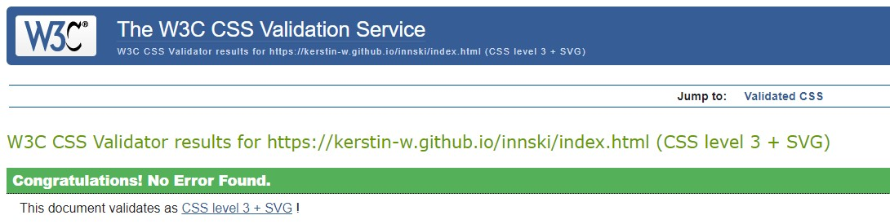
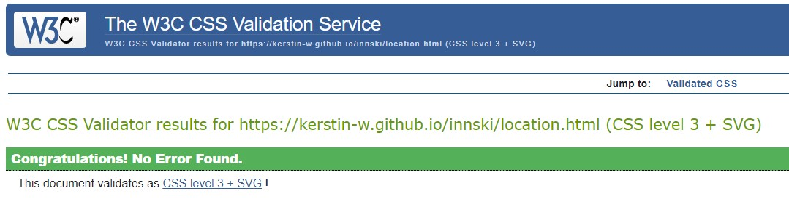
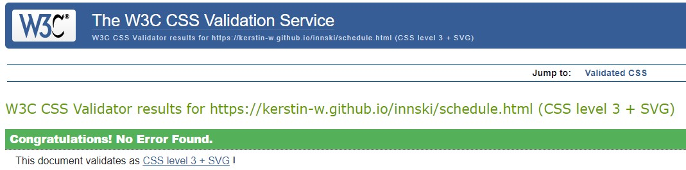

# Testing

## Contents

- [Functional Testing](#functional-testing)
- [Validator Testing](#validator-testing)
  - [HTML](#html)
  - [CSS](#css)
- [WAVE](#wave)
- [LightHouse](#lighthouse)
  - [Destop Results](#desktop-results)
  - [Mobile Results](#mobile-results)
- [Browser Compatibility](#browser-compatibility)
- [Responsivity](#responsivity)
- [User Stories](#user-stories)
- [Site Owner Goals](#goals)
- [Issues/ Bugs Found & Resolved](#issues-bugs)
- [Unresolved](#unresolved)

## <a name="functional-testing">Functional Testing</a>

---

| Page | Test | Completed successfully |
| :----| :----| :---------------------:|
| All| Navigation links to relevant pages| Yes |
| All| Navigation collpases to a hamburger menu on mobile| Yes |
| All| Logo links back to homepage| Yes |
| All| Social media icons in the footer link to the correct external link and open in new tab| Yes |
| Homepage| Call to action button links to singup page | Yes |
| Homepage | Images and text flex responsively | Yes |
| Location | Images and text flex responsively | Yes |
| Schedule| Text flex responsively | Yes |
| Sign Up | User can only input the email address in the correct form | Yes |
| Sign Up | User can only submit when all required fields are filled in | Yes |

## <a name="validator-testing">Validator Testing</a>

---

### <a name="html">HTML</a>

[W3C](https://validator.w3.org/)

The initial test returned an error for the Youtube iFrame and a warning for the Gallery section and errors for the hamburger menu. 

Initial test

Homepage

Location Page

Schedule Page

Signup Page

### <a name="css">CSS</a>

[W3C](https://jigsaw.w3.org/css-validator/) 

This test returned no errors.

Homepage

Location Page

Schedule Page

Signup Page

## <a name="wave">WAVE</a>

---

 [WAVE](https://wave.webaim.org/) This extension was used to highlight aspects that were an issue within the code. 

 The first result gave an error for a missing form label button on the Sign up page and an empty form label for the hamburger menu on the homepage.

 The missing form label button on the Sign up page was due to a typo. 

 Since the hamburger menu could only be created with HTML and CSS (rather than JavaScript which would be the better and accessibility better solution) the HTML symbol for hamburger menu has been added here to fix the bug. 

 
